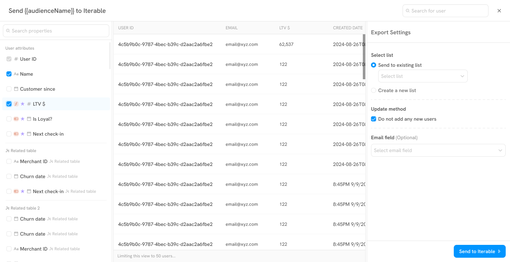

# Enable Data Sync

This guide outlines the steps to sync an audience and respective user properties from Sortment to your Customer Engagement Platform (CEP).

#### **Step 1: Initiate the export**

Right-click on the audience you want to sync and select **Export Audience**. This will open the audience preview window.

#### **Step 2: Select attributes to sync**

Choose the user attributes you’d like to include in the sync. Only selected fields will be sent to your CEP.

* **User identifier:** This could be a **`User ID`** or **`Email`**
* **Traits**: Examples include _Lifetime Value (LTV)_, _Customer Since_, or _Is Loyal?_
* **User properties**: Consider syncing data like _check-in history_ or _churn date_ for more personalised messaging.

<figure><figcaption></figcaption></figure>

#### Step 3: Choose destination

In the **Export Settings** panel, choose where this audience will be sent. You have two options:

* **Send to existing list** – Choose from your existing lists within the CEP.
* **Create a new list** – Define a new list name and an optional description. This list will be created during the first send.

<figure><figcaption></figcaption></figure>

#### Step 4: Set the update method

Control how Sortment handles new user records using the **"Do not add any new users"** check:

* **Checked (Do not add any new users)**\
  Only users who already exist in your CEP will be updated. Users in your Sortment audience who are not found in the CEP will be skipped.
* **Unchecked (Do not add any new users)**\
  Both existing users will be updated and new user records will be created as needed.

#### Step 5: Specify Email field (Optional)

If your CEP uses **email** as a primary identifier, you can map the email field during export. This is especially useful for platforms that support both **User ID** and **Email** as identifiers.

#### Step 6: Send to CEP

Once all settings are configured:

* **Review** your selected fields and export preferences.
* Click **"Send"** to begin syncing.

Sortment will package your audience and push the data to the designated list in your CEP, updating or creating records according to your selected update method.
