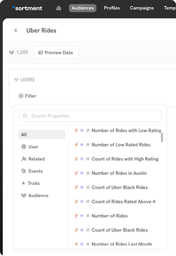
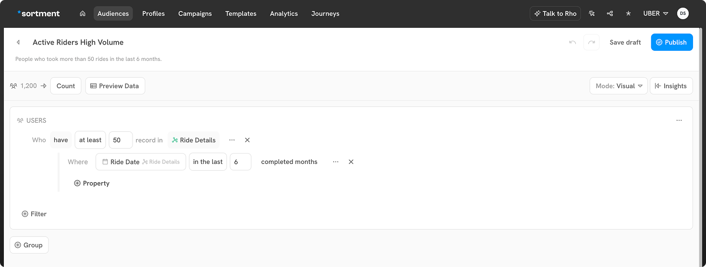
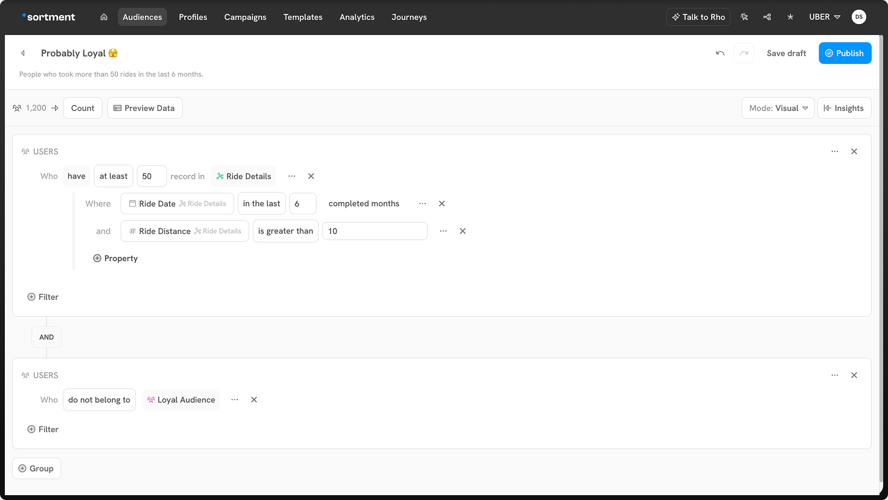

# Audience Filters

Filters are the core of the visual builder. You can mix different conditions to segment your users to a specific audience. The builder provides various types of filters you can use with Boolean (AND / OR) logic:

* User properties
* Related properties
* Events
* Audiences

<figure><figcaption></figcaption></figure>

### User properties

User properties are the most basic conditions. You can use it to filter audiences based on the column values in your primary table, which contains users.&#x20;

For example, if your primary table is a table of customers of uber and includes columns like device and created at date, you can create an audience of:

* All users who have device "iPhone"&#x20;

AND&#x20;

* All users who got created after 1st Jan 2023.

### Related properties

The related properties filter users based on data in related tables. These tables are any non event table added to the schema.

For example, if your primary table is users for uber and you have related table for their rides and ride\_details, you can create audiences like this:

* All users who have completed at least one ride

AND&#x20;

* All users who have taken at least one ride in "premium" ride type.

### Events

The events filter audiences based on what events they've performed. To use it, you need to have [set up events](../../schema/setting-up-events-table-1.md). You can check whether event was performed or not performed when building your audience.

For example, if your primary table is customers who rode with uber and there is an events table that collects clickstream data, you can create audiences like this:

* All users that requested a ride of uber black between 3rd Oct 2023 to 3rd Nov 2023 with ride fare greater than 1000

OR

* All users who made payment for a ride after 3rd Oct 2023 with payment value greater than 500

### Audiences

The audience filters users based on whether they're a part of another audience. This condition helps reuse standard audience groups without creating them again and create complex audiences while ensuring you're not duplicating users across campaigns.

For example, if we take the uber, you can create an audience like this:

<figure><figcaption></figcaption></figure>

### Groups

You can also create nested conditions in audience builders upto two levels. Groups allow you to create independent audience logic which are combined to get final set of users based on Boolean logic (AND/OR).

For example, you're running a campaign to find out users who are probably loyal to your brand. You could create an audience with following filter conditions:

* All users who have at least completed 50 rides in the past 6 months and distance covered through uber is greater than 10 km.

AND

* All users who do not belong to "Loyal Audience"

<figure><figcaption></figcaption></figure>

You can toggle group boolean condition by clicking on AND/OR in the query. This makes it easier to organise logic around different groups.

### Filter operators

Filter operators allow you to build your filter conditions. For example, you may want to add a related property condition based on users' device or an event condition based on when an action occurred.&#x20;

The operators depend on the underlying data type you're filtering on—either textual, numerical, boolean, or timestamp. Events have operators for performed and not performed. Audience conditions only provide the operators is included in and is not included in.

#### Text operators

When filtering on textual properties, for example on a product's brand or a user's device, you can use these operators:&#x20;

* is null
* is not null
* is
* is not
* starts with
* ends with
* includes
* does not include

These operators also get a flag for case sensitivity. While selecting the dropdown, you can choose to make your selections case sensitive based on your use case.&#x20;

The textual filters allow you to add multiple values. To add multiple values, type a value and press enter. This will allow you to add another value for the same filter condition.

#### Numeric Operators

When filtering on numeric properties, for example on a product's price or order amount, you can use these operators:&#x20;

* is null
* is not null
* is
* is not
* is less than
* is greater than

The textual filters allow you to add multiple values. To add multiple values, type a value and press enter. This will allow you to add another value for the same filter condition.

#### Boolean operators

When filtering on Boolean (true or false) values, you can use these operators:

* equals
* does not equal
* exists
* does not exist

#### Timestamp operators

When filtering on timestamps, you can use these operators:

* is null
* is not null
* is
* is not
* in the last
* not in the last
* in the next
* in the current
* is before
* is on or before
* is after
* is on or after
* is between
