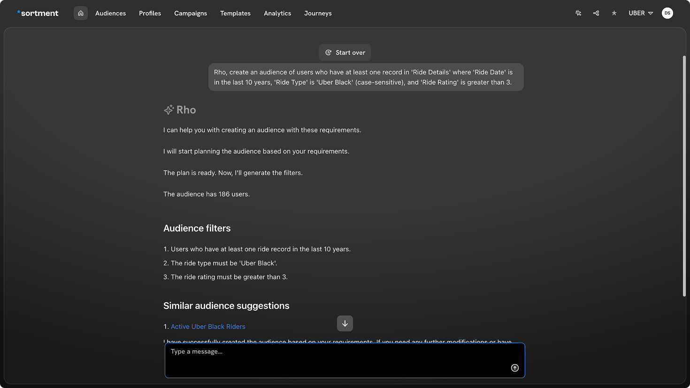
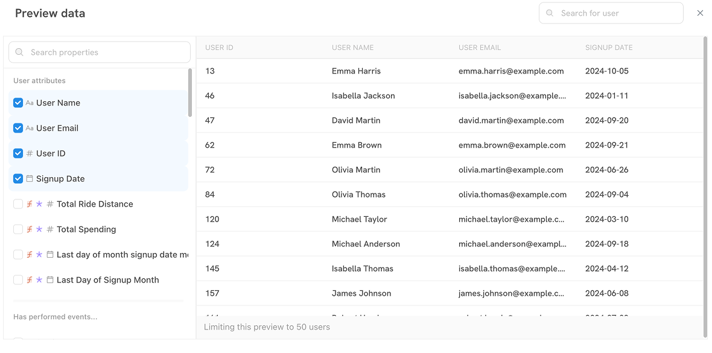

# Create Audience with AI

Sortment's AI, Rho, makes audience creation incredibly intuitive and efficient. Instead of manually building complex filters, you can simply tell Rho your audience requirements in plain language, and it will set up the audience for you.

**The streamlined process for creating an audience with Rho:**

1. **Tell Rho your requirements:**
   * Start by engaging Rho directly with your audience criteria. For instance, you could say:
     * "Rho, create an audience of users who have at least one record in 'Ride Details' where 'Ride Date' is in the last 10 years, 'Ride Type' is 'Uber Black' (case-sensitive), and 'Ride Rating' is greater than 3."
   * Rho will confirm its understanding and begin processing your request.&#x20;

<figure><figcaption></figcaption></figure>

2. **Review the Auto-Populated Audience:**

* Once Rho has processed your request, it will automatically navigate you to the visual builder page.
* Here, you'll find the filters pre-populated based on your instructions to Rho. This allows you to visually inspect the logic and ensure it matches your intent.
* **Audience Count:** In the upper bar of the Audience Builder, you'll immediately see the calculated count of users that fit your specified criteria. This gives you an instant understanding of your audience size.
* **Audience Insights:** On the right-hand side, the "Audience Insights" panel provides valuable breakdowns and reachability information, helping you understand the composition and potential impact of your audience.

<figure><figcaption></figcaption></figure>

3. **Preview your Audience data:**

* To get a closer look at the actual users in your audience, click on the **"Preview data"** button
* A modal window will appear, displaying unique id of users.
* **Select columns for preview:** On the left side of the preview window, you can use the checkboxes to select specific user attributes (e.g., User ID, User Name, User Email, Signup Date) that you want to see in the preview table. This helps you verify the data points relevant to your campaign.
* Once you've selected your desired columns, click the "x" button to close the preview window and return to the visual builder.

<figure><figcaption></figcaption></figure>

4. **Save and Publish Your Audience:**

* Rho automatically provides a name and description for the audience. However, you have the flexibility to change these to provide more context and clarity specific to your audience's purpose.
* After reviewing the audience definition, count, insights, and data preview, you can proceed to save as draft or publish your audience.
* Locate the **"Publish"** button in the top bar of the visual builder. Clicking this will finalise your audience, making it available for use in your campaigns and other Sortment workflows.

By leveraging Rho, you can create highly targeted audiences with speed and accuracy, empowering your marketing efforts directly from your data warehouse.
