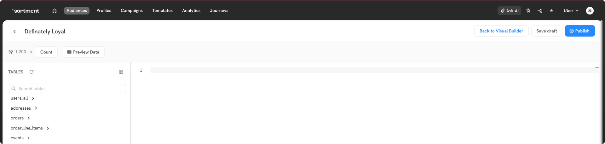
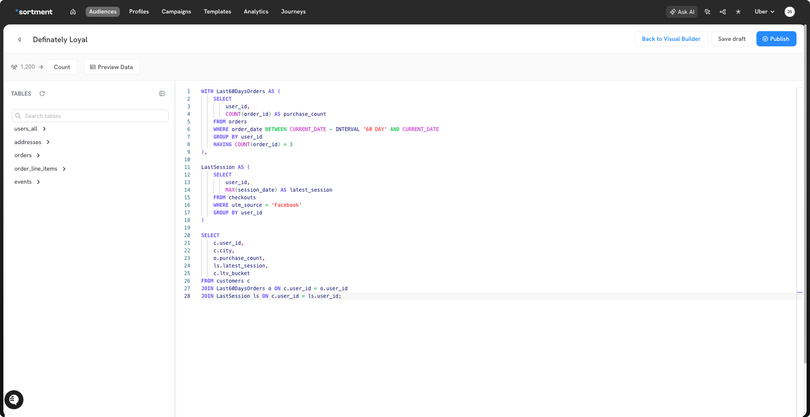

# Creating Audience Using SQL Builder

Sometimes, the querying may be complex due to the nature of data modelling in the warehouse. Sortment allows you to create SQL based audiences directly.

&#x20;It also enables Gen AI based flow where user can generate SQL queries using prompts, and improve them.

### Required skillset

This requires a technical understanding of your data tables and SQL. With the AI generated query, a user review may be requried to validate the correctness. Data or analytics engineers are often involved.

### Creating audience

1.  Go to Audiences page and click Create Audience. Switch to the SQL editor view.

    <figure><figcaption></figcaption></figure>
2. The SQL editor supports executing any SQL specific to your database or data warehouse.
3. You can also generate a query from a prompt. This will use GPT-4 to generate an SQL query. Verify that the query logic is correct.
4. You can preview audience data with count of your audience for the current SQL query.
5.  You can improve an SQL query using AI. This will take your text prompt and existing query as input to generate a new query.

    <figure><figcaption></figcaption></figure>
6. Save the query once you've verified the output. Ensure that user ids are part of your SQL query. Sortment will only access user data based on user ids. When saving an audience, you need to define which column in your SQL generated output has user ids. You can read more about saving and sync [here](../../settings/sync-schedules.md).
