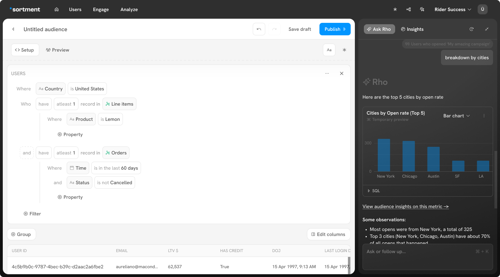
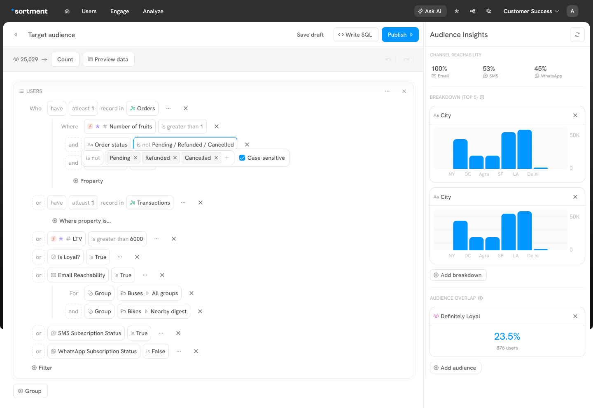

# Creating Audience

Once the schema is setup, you can start creating your audiences using data from your warehouse.

### Required skillset

Building audiences requires an understanding of your business goals. Usually, business stakeholders like marketers complete this step.

### Using AI to create an audience

Sortment’s **Ask AI** lets you create complex audiences using natural language.

Lets create a audience for an eCommerce company in the US:

1. Click on _"Ask AI"_ on the top navigation bar
2. In the input field type the audience prompt you want to create.

#### Example prompt

> **"Create an audience of users in US who have purchased the product 'Lemon' at least once, and who also placed at least one order in the last 60 days that was not cancelled, breakdown by cities"**

<figure><figcaption></figcaption></figure>

3. Ask AI will take you directly to the Visual builder, with the logic auto-populated based on your prompt.
4. You can start with a broad idea and refine it naturally. Our AI understands your intent and adapts in real-time, allowing you focus on _who_ you want to reach while we handle _how_.
5. You can **visualise the generated audience** in real time.
6. Click **“Preview data”** to verify that the audience matches your intent.
7. **Give your audience a name**, and optionally add a description for context.
8. To use this audience in **campaigns and journeys**, click **“Save and Publish.”**

#### 💡 Tip

> In most cases, **Ask AI is accurate enough to fully create your audience**, saving you the need to manually configure filters in the visual builder.

### Creating audience using visual builder

1.  Go to Audiences page and click + Create Audience. 

    <figure><figcaption></figcaption></figure>
2. Build your audience using filters and groups. The fields defined in the schema are usable in the visual builder.
3.  As you build your audience, you will see an count of your audience with current filters. 

    <figure><figcaption></figcaption></figure>
4.  As you build, click Preview data to verify the audience you're building is the intended one. Close the preview to back to the visual builder 

    <figure><figcaption></figcaption></figure>
5. Give the audience a name, and optionally a description to add more context to your audience.
6. If you want to save your progress and work on the audience later, click **Save as draft**.
7.  If you want to save this audience to use into Journeys, click **Save and publish**. This will take you through data preview and setting up an audience sync. 

    <figure><figcaption></figcaption></figure>

<figure><figcaption></figcaption></figure>

4. While building, use "Preview Data" to confirm your intended audience. After previewing, close it to return to the visual builder.

<figure><figcaption></figcaption></figure>

5. Provide a name and optionally, a description to add context
6. To save this audience for use in Journeys or Campaigns, click **Save and publish**. This will guide you through data preview and audience sync setup.
7. To save your progress for later, click **Save as draft**.
