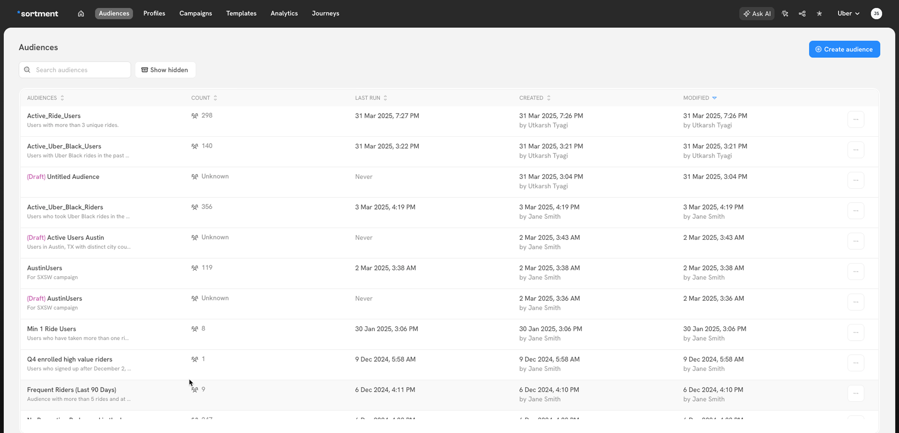

# Managing Audiences

### Save/Publish an audience

When creating an audience, you can "Save as Draft" to preserve your progress or "Publish" it using the icon in the top navigation bar.&#x20;

Publishing is a two-step process, common to both visual and SQL audiences: first, you'll verify the data in a preview (showing a sample of users and total audience size), then you'll publish.

In case of SQL audiences, you also need to choose the output column which has User ID, so that Sortment can use it to reference users in Campaigns.

<figure><figcaption></figcaption></figure>

<figure><figcaption></figcaption></figure>

### Audience Manager

From the audience manager, you can get a snapshot view of all the created audiences and their freshness details:

<figure><figcaption></figcaption></figure>

1. **Audience name**: Name of the audience with the description
2. **Audience size:** Count of number of unique users in the audience. Actual reachability of an audience may be less than this count.
3. **Last run:** Time of latest run and its  corresponding status. In case of failure, it is highlighted here.
4. **Created:** Creation information with timestamp and name of the user who created this audience
5. **Modified:** Modification information with timestamp and name of the user who modified this audience

### Duplicate flow

Since audiences can have interdependencies different objects in Sortment like Campaigns and Flows, there is no edit flow.&#x20;

After creating an audience, you can clone it by opening the horizontal three-dot menu and clicking Duplicate.

This opens a new audience creation page where you can:

* edit the duplicate audience's configuration
* give it a custom name and description
