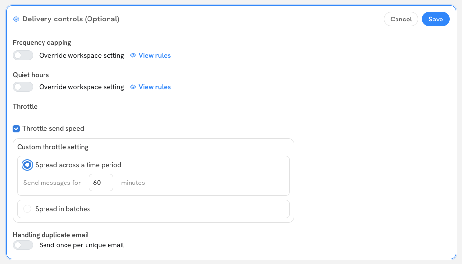
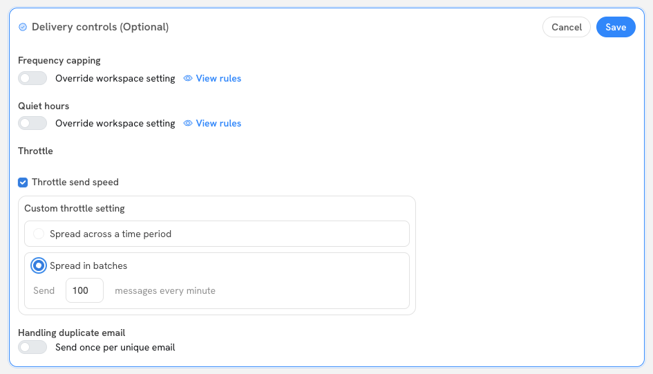

# Throttling Campaign Sends

Throttling lets you control the rate at which Sortment sends messages in a campaign. Instead of blasting your entire audience at once, you spread sends out over time — protecting your sending infrastructure, avoiding sudden spikes on downstream systems, and giving you more control during sensitive periods like IP warm-ups.

## How to enable throttling

Throttling is configured inside **Delivery Controls** when building or editing a campaign. Check the **Throttle send speed** box to reveal the custom throttle settings.

<figure><figcaption>
Delivery Controls panel with Throttle send speed enabled, showing the "Spread across a time period" option selected
</figcaption></figure>


Delivery Controls are optional and apply per campaign. Workspace-level defaults for frequency capping and quiet hours are separate settings.


## The two throttle modes

### Spread across a time period

Sortment divides your audience evenly and distributes sends uniformly over a window you specify in minutes. For example, setting **60 minutes** sends to all recipients spread equally across that hour.

This is the **default mode** when you enable throttling.

**When to use it:** When you want predictable, smooth delivery and don't need to control exact per-minute volume. Good for general campaigns where you want to avoid a simultaneous spike.

### Spread in batches

Sortment sends a fixed number of messages every minute until the full audience has been reached. For example, setting **100 messages every minute** will dispatch 100 sends per minute continuously until the campaign is complete.

<figure><figcaption>
Delivery Controls panel with "Spread in batches" selected, configured to send 100 messages every minute
</figcaption></figure>

**When to use it:** When you have a hard throughput ceiling — for example, a downstream system or provider that can only handle a certain volume per minute.

## Throttling and delivery controls interact

Throttling does **not** bypass other delivery controls. Quiet hours and frequency capping still apply during the throttle window.


If a throttle window overlaps with a quiet-hours block, sends scheduled for that period will be held until quiet hours end — they do not skip ahead. This can cause sends to pile up and fire in a burst once quiet hours lift, partially defeating the purpose of throttling.

Always check your quiet-hours configuration before setting a throttle window. See [Delivery Controls](building-a-campaign.md#delivery-controls) for details.


## Throttling during IP warm-ups

When warming up a new sending IP or domain, throttling is one of two complementary tools — the other being **audience splitting**.

- **Audience splitting** limits the total number of recipients in a given send, keeping volume low per campaign.
- **Throttling** controls the rate within a single send, preventing bursts that inbox providers may flag.

Used together, they give you fine-grained control over both *how many* messages go out and *how fast* they go out. A typical warm-up sequence might start with a small audience split (e.g. 5–10% of the list) combined with a time-period throttle, then gradually increase both over successive sends.


For warm-ups, use audience splitting to control total volume per campaign and throttling to smooth the send rate within each campaign. Relying on only one of the two is usually insufficient.


## Quick reference

| Mode | What you configure | Best for |
|---|---|---|
| Spread across a time period | Duration in minutes (default: 60) | Smooth, even delivery over a time window |
| Spread in batches | Number of messages per minute | Hard throughput caps, provider rate limits |


Both modes respect all other delivery controls. Plan your throttle window around your quiet-hours schedule to avoid unintended send bunching.

