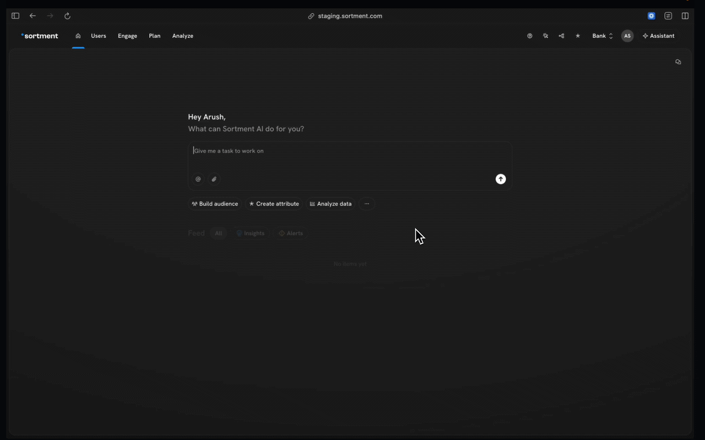

# Bulk Unsubscribe

Sortment allows you to bulk unsubscribe users from a subscription group or globally using either their **email address** or **primary user ID**.

***

### Navigation

1. Click on your **workspace name** in the top-right corner
2. Go to **Settings**
3. Select **Subscription Groups**
4. Click **Import Email Unsubscribers(global unsub)** or **+New Group(subcription group)**

<figure><figcaption></figcaption></figure>

***

### Prepare Your CSV File

Create a `.csv` file with a single column containing the list of users you want to unsubscribe.

> ⚠️ The column header name is required and must be exact — the import will not work otherwise.

#### Unsubscribe by Email

Use this method if you want to unsubscribe users via their email addresses.

* **Column header:** `channel_id`
* **Column values:** List of email addresses to unsubscribe

**Example:**

```csv
channel_id
john@example.com
jane@example.com
user@company.com
```

***

#### Unsubscribe by Primary Identifier

Use this method if you want to unsubscribe users via their primary user ID.

* **Column header:** `user_id`
* **Column values:** List of primary user IDs to unsubscribe

**Example:**

```csv
user_id
usr_001
usr_002
usr_003
```
