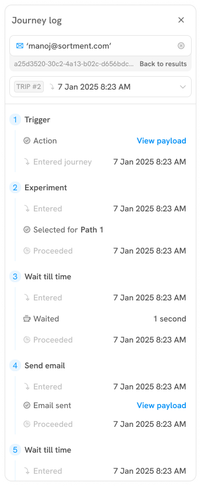
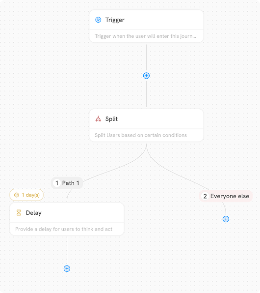
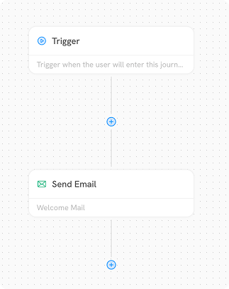

# Journey Builder

## Taking a tour of the canvas

The Journey Builder canvas is your workspace for designing journeys. Let's explore the key elements based on the provided in the image below:

<figure><figcaption></figcaption></figure>

* **Navigation Bar:** Located at the top of the screen, this bar provides access to essential journey information and actions. In the screenshot, we see:
  * **Back button:** A left arrow to navigate back to the main Journeys list.
  * **Journey name:** Displays the current journey's name ("Split everyone else")
  * **Version:** Shows the version you're viewing. You may have multiple journey versions (past versions that have been stopped) or future version that is currently a draft.
  * **Last refreshed information:** Indicates the last time the analytics data on the canvas was updated ("Data last refreshed at 9 May 2025, 11:41 AM)&#x20;
* **Journey Log:** The initial screenshot showed a "Search for a user" bar. When a user is searched, the sidebar transforms to display a **Journey Log** for that specific user, as seen in the image below.

<figure><figcaption></figcaption></figure>

The Journey log provides a chronological view of a specific user's progression through the journey. It includes:

* **User identification:** Information about the searched user (e.g., email address: "'manoj@sortment.com'").
* **Journey entry point:** The trigger that initiated the user's journey.
* **Block progression:** A step-by-step record of the blocks the user has entered, waited in (for Delay blocks), and proceeded through, along with timestamps.
* **Payload information:** For certain blocks (like "Send email"), there might be an option to "View payload," to see the exact detail with which the email for sent to the user.
* **Branching information:** If the journey involves split blocks or conditional logic, the log indicates which path the user took.

**Canvas:** This is the primary area where you visually construct your journey using blocks and connections. The image illustrates a journey starting with a **Trigger** block, followed by a **Split** block that directs users along different paths: **Path 1**  being the filtered path and **Path** **2 as everyone else** (who don't qualify any filters on split block). **Path 1** includes a **Delay** block. Each block displays a name and a "description" placeholder, where you can add descriptions for better clarity. More about different types of blocks [here](journey-components/#journey-components).

<figure><figcaption></figcaption></figure>

* **Bottom toolbar:** Positioned at the bottom of the screen, this bar offers options for managing the canvas view and performing actions:
  * **Zoom controls:** A "100%" dropdown, indicating options to adjust the zoom level of the canvas.
  * **Alignment options:** To allow user to re-align the journey blocks to  organise them on the canvas.
  * **Download as image:** Export the journey canvas as PNG for reference and sharing with team beyond the platform.

## Journey settings

Journey settings define how users interact with your journey—from when it starts, how often users can enter, to what counts as a conversion. Access these settings via the **gear icon** in the top navigation bar.

Key sections include:

* **About**: Basic journey info (name, description, timestamps).
* **Scheduling**: Set the journey's start and optional end time.
* **Entry limits**: Control how many times users can enter.
* **Exit rules**: Define conditions that remove users from the journey.
* **Goals & metrics**: Track conversions and performance.

Read more on [Journey Settings](journey-settings.md#undefined) page on what each section does.

## Blocks

Blocks are the fundamental units for building your journey in Sortment. Each block represents a specific action or decision point for the customer.

### **Adding blocks**

To add a new block to your journey:

1. Locate the **plus icon with a circle** (**⊕**). These icons appear at the end of a sequence of blocks (as seen in Image 2) or in the middle of connections to allow you to to insert a block.
2. Click on the **⊕** icon. This will open a sidebar displaying the available block types (e.g., Trigger, Send SMS, Send Email, Delay, Split, etc.).
3. Select the desired block type from the menu. The new block will be added to the canvas, connected to the preceding block.

**Starting with a Trigger:** Every journey must begin with a **Trigger** block. This block defines the event or condition that initiates the journey for users.

<figure><figcaption></figcaption></figure>

### **Editing blocks**

To modify the settings of an existing block:

1. **Click directly on the block** you want to edit on the canvas.
2. Upon clicking a block, a **panel** will open on the right-hand side of the screen (as seen in the image below for the "Send Email" block).
3. Within this panel, you can configure the specific settings for that block (e.g., email content, SMS message, delay duration, split rules, trigger conditions).


Editing is allowed only for a draft version of a journey.


<figure><figcaption></figcaption></figure>

### **Adding blocks in the middle**

To insert a block between two already connected blocks:

1. Click on the **plus icon** (**⊕**) over the connection line between two blocks
2. A menu or sidebar with available block types will appear.
3. Select the desired block type. The new block will be inserted between the two existing blocks, automatically connecting them.

### **Deleting blocks**

To remove a block from your journey:

1. **Click on the block** you want to delete on the canvas.
2. The **block properties panel will open on the right-hand side**.
3. Within the block properties panel, look for a **trash bin icon**.
4. Click on the **trash bin icon** to delete the selected block.

### **Connecting blocks**

Blocks are automatically connected when you add them using the **⊕** icons. The visual lines between the blocks represent the flow of users through the journey.

You can also click on the path and press 'Delete' key to delete the connection.&#x20;

When you delete the block, any journey blocks below this block will not be connected automatically. To make a connection, you can click on the ⊕ icon and drag over to the block you want to connect it with.

### **Setting up blocks**

As mentioned in "Editing Blocks," you configure the behaviour of each block through the properties panel that appears on the right when you click on a block. This panel will vary depending on the type of block selected. For example, the "Send Email" block shows options for defining sending information and email content. Blocks marked with a **red exclamation mark and "Setup pending"**  indicate that required configurations are missing.

## **Saving your journey**&#x20;

Sortment journey builder does **not** autosave. To preserve your progress, you need to manually click **Save Draft** in the top right corner of the screen. This saves your work in a draft state, allowing you to return and make changes before launching.
