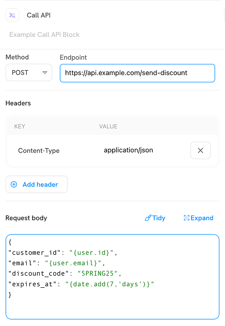

# Action blocks

The **Action** blocks in Sortment Journeys defines the communication or outputs triggered for users as they progress through a journey. These actions are critical for delivering messages across various channels - Email, SMS, WhatsApp - or for triggering updates and integrations via API.

Let's explore each block and how to configure them effectively:

### 1. Send Email

**Purpose**: Deliver an Email to users at a specific point in their journey.

**Configuration steps**:

* **Sending information**:
  * **Integration**: Defaults to the configured email provider (e.g., Sendgrid) but can be changed.
  * **Send as**: Auto-populated with the default sending identity (e.g., `Marketing Sortment`).
  * **Reply to**: Pre-filled, but editable to suit campaign needs.
  * **Send to**: Select the appropriate Email field from user properties.
  * [**Subscription group**](../../settings/subscription-groups-and-contact-fields.md#how-subscription-groups-work-in-sortment) : Select subscription group you want to send message. Ensure the message respects user opt-in preferences.

<figure><figcaption></figcaption></figure>

* **Content**:
  * **Start from scratch:** Create a new email template manually.
  * **Browse templates:** Use an existing saved template.


**Status Tags**:

"Setup pending" appears if required fields like recipient or content are missing.


***

### 2. Send SMS

**Purpose**: Send a text message to users at a defined point in their journey.

**Configuration steps**:

* **Sending information**:
  * **Integration**: Default SMS provider (e.g., Twilio) is pre-selected. Can be changed.
  * **Send to**: Choose the user’s mobile number from available properties.
* **Content**:
  * **Start from scratch:** Create a new message.
  * **Browse templates:** Select from saved SMS templates.

<figure><figcaption></figcaption></figure>


**Status tags**:\
"Setup pending" appears when the block is not fully configured or some entries are missing.


***

### 3. Send WhatsApp

**Purpose**: Sends a WhatsApp message to users.

**Configuration steps**:

* **Sending information**:
  * **Integration**: Pre-set based on your default WhatsApp channel. Editable.
  * **Send to**: Choose a WhatsApp contact property from the user profile.
* **Content**:
  * Select from already existing templates or create a new one from scratch.

<figure><figcaption></figcaption></figure>


Setup pending will appear if the block isn’t fully configured (e.g., missing template or incomplete integration).


### 4. Call API

**Purpose**: Sends an HTTP request to an external API as part of a user’s journey. Useful for webhooks, syncing external systems, or fetching decision data.

<figure><figcaption></figcaption></figure>

**Configuration fields**:

* **Method**: Choose from standard HTTP methods:
  * `GET` – retrieve data from an endpoint.
  * `POST` – send new data to an endpoint.
  * `PUT` – update existing data.
  * `DELETE` – remove data.
* **Endpoint**: Enter the full API URL. (Must begin with `http://` or `https://`).
* **Headers**: Add key–value pairs for content-type, auth tokens, etc.
* **Request Body**: JSON formatted. (Use **tidy mode** or expand for easier editing).
* **Mapping API Response**:
  * **Use keys from response payload:** Map data returned by the API for use in later blocks.
  * Paste a JSON response to extract and select values, or manually add fields.


Note: Use the “@” symbol to dynamically reference user-specific properties from your schema throughout the API call configuration.



"Setup pending" will appear until all required fields (at minimum, method and endpoint) are properly configured.


***

### 5. Update trait

**Purpose**: Updates a user trait (property) within the journey. Helpful for tracking status, assigning flags or storing metadata.

<figure><figcaption></figcaption></figure>

**Configuration fields**:

* **Select property**: Choose or create a trait (e.g., `status`, `segment`).&#x20;
* **Set value to**: Define the new value for the selected trait.
  * You can enter static values directly (e.g., `"betaUser"`).
  * Or insert dynamic values from earlier steps in the journey using the **@** token selector (e.g., from API response or event payload).

**Use cases:** Track engagement, assign test variants, or mark users progress for downstream targeting.

***

### 6. Add to journey

**Purpose**: Move users to another journey, enabling modular flows and multi-step campaigns.

**Configuration fields**:

* **Add users to**: Choose a target journey from the list of available, externally enabled journeys.


**Note:** Only published journeys that are configured to accept external entries will appear in the dropdown.\
\
If the desired journey isn’t listed, ensure the target journey includes a **Trigger block**, is fully configured, and has been **published**. You’ll need to complete those steps before you can connect it via the **Add to Journey** block.


This block is useful for handing off users to specialised flows, like feedback collection, re-engagement campaigns, or transactional messaging sequences.
