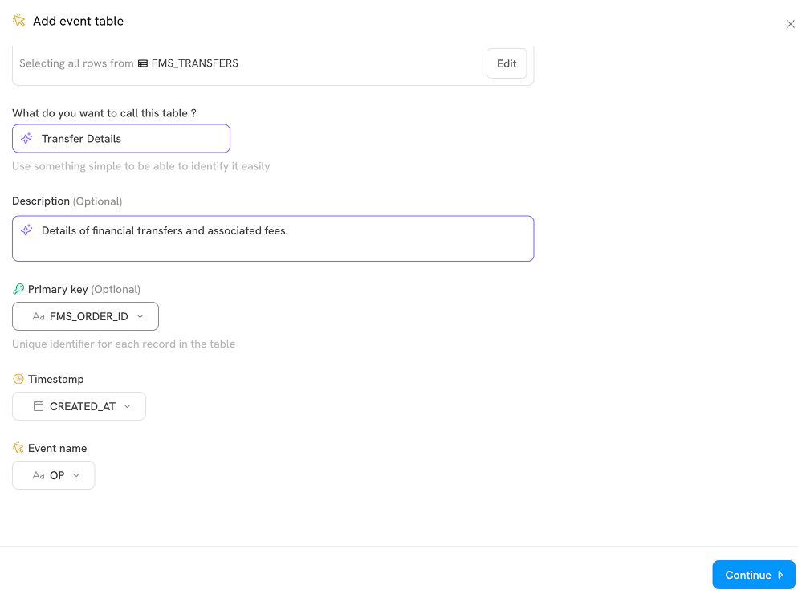
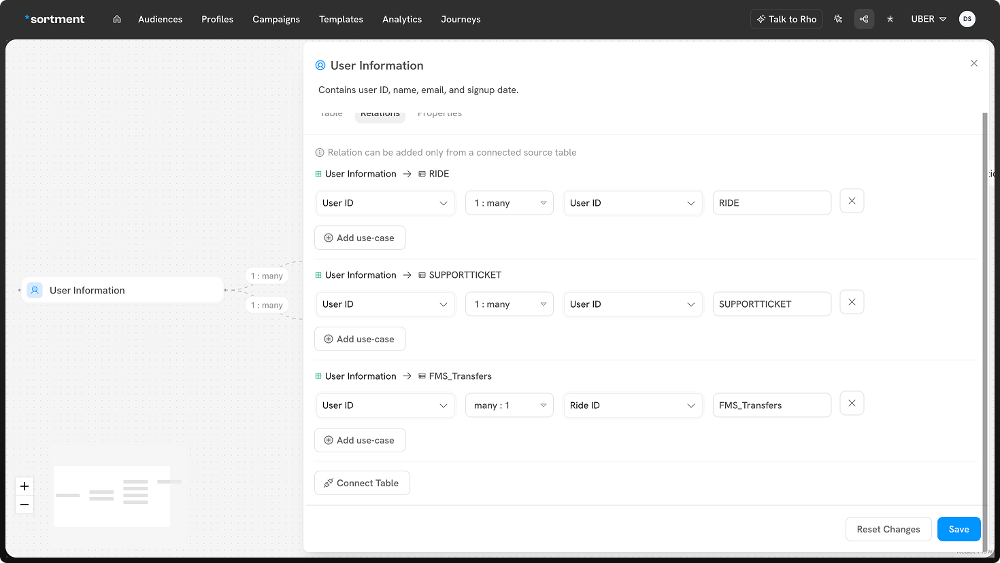

# Setting Up Events Table

Sortment allows you to track event-based data by adding **event tables** to your schema. These tables capture timestamped actions such as transfers, checkouts, or logins. Here's how to set up an events table (e.g., `FMS_TRANSFERS`) from a connected warehouse or CSV upload:

#### Adding an events table

Setting events table is similar to setting the related table. Primary difference being events table contain information of various events performed by user on your website, app or else while the related table contain all the other information about your data.

1. In the **schemas** view, click the **“Add table”** button (top right of the canvas).
2. From the dropdown, select **“Add event table.”**

.png>)

2.  In the **setup** step, choose your source:

    * **Warehouse** – Select this if you're linking to a table already synced with Sortment's data warehouse.
    * **CSV** – Use this if you're uploading data from a CSV file.

    

For CSV upload make sure your file follows the format:

<strong>Headers</strong> must contain only <strong>letters, numbers, or underscores,</strong> No spaces or special characters are allowed in header names and each header must be <strong>≤ 255 characters</strong>.

The CSV file must be less than 50MB in size.

3. Once you select your source, choose the appropriate table (e.g., `FMS_TRANSFERS`) and click **continue**.

.png>)

4. Configure Table Details
   1. **Name your events table** – Pick a name that clearly describes the event (e.g., “Transfer Details”).
   2. **(Optional) Add a description** to help identify the table’s purpose.
   3. **Choose a primary key** – This should be a unique identifier for each event.
   4. **Select a timestamp** – This is required for event tables and represents when the event occurred.
   5. **Specify the event name** – This defines the type of event (e.g., `TRANSFER_COMPLETED`, `REFUND_INITIATED`).

Click **continue** to proceed.

7. Configure the following table properties for each column:
   1. **Visibility:** Turn a column on or off depending on whether you want to use it in Sortment.
   2. **Labels:** Sortment will autosuggest labels and descriptions for your table. Label the fields in your events table. These can be used to filter on events data in Audiences.
   3. **Descriptions** _(optional):_ Describe what your column contains.
   4. **Masked toggle**: Turn this on for sensitive information (e.g., personal identifiable data). Masked data will be protected and hidden by default in UI previews to comply with regulations and security.
   5. **Cached toggle**: Caching a column stores unique values from the column to make them accessible in the filter dropdowns.

8. Once you've configured all the necessary properties, click **“Save”** to finish adding your related table. The new table will now appear in your schema. Now let's define this table's relation to other tables already existing in your schema.

### Joining Tables

1. **Select the table** you want to work with (e.g. `User Information`).
2. Go to the relations tab to join the  `FMS_Transfers`  with  `User Information` .

<figure><figcaption></figcaption></figure>

3. Click **connect table** at the bottom.
4. In the join setup:

* Choose the **column from the current table** you want to join on (e.g. `Id` from `User Information`).
* Select the **join type** (`1:1`, `many:1`, etc.).
* Pick the **column from the target table** you want to join to (e.g. `FMS ORDER ID` from `FMS_Transfers`).

<figure><figcaption></figcaption></figure>

5. Once your configuration is complete, click **Save**.

This will link the data across tables based on the selected keys, enabling richer queries and insights.
