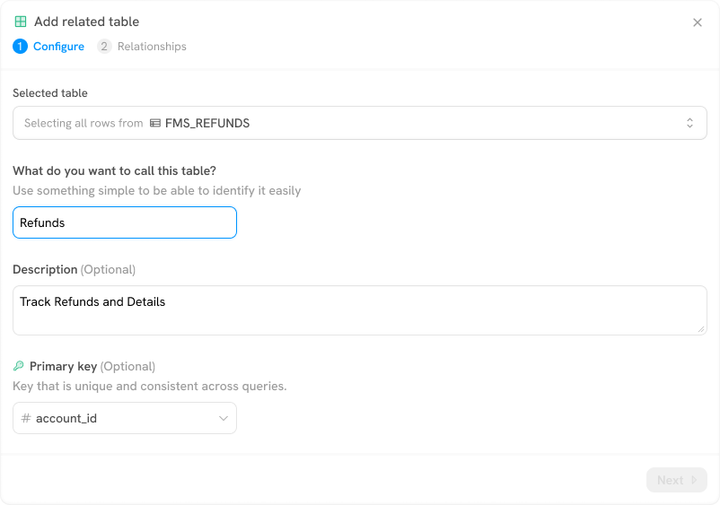
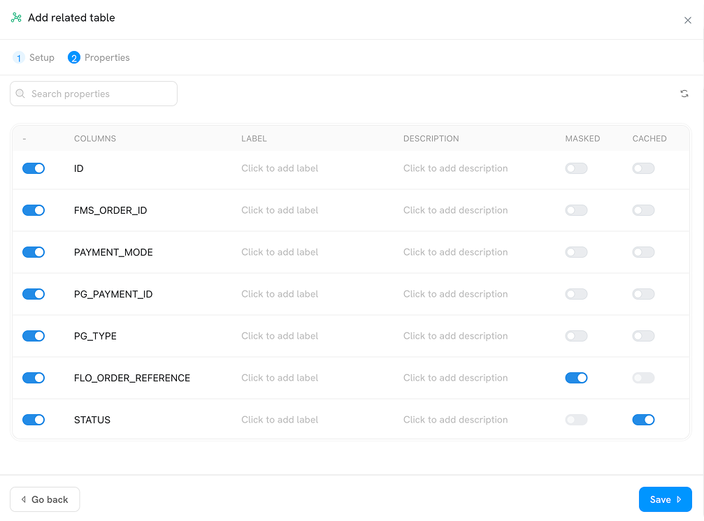
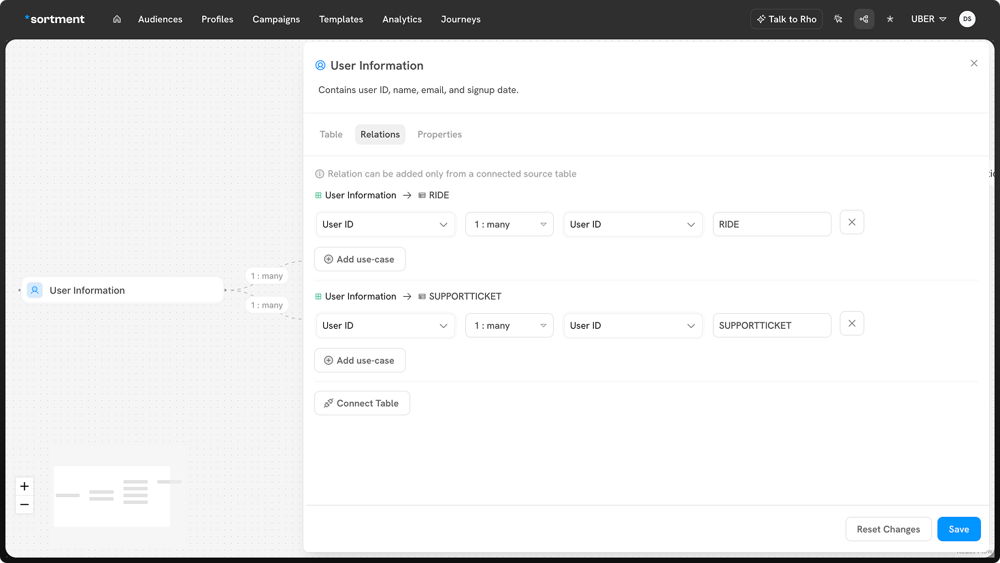
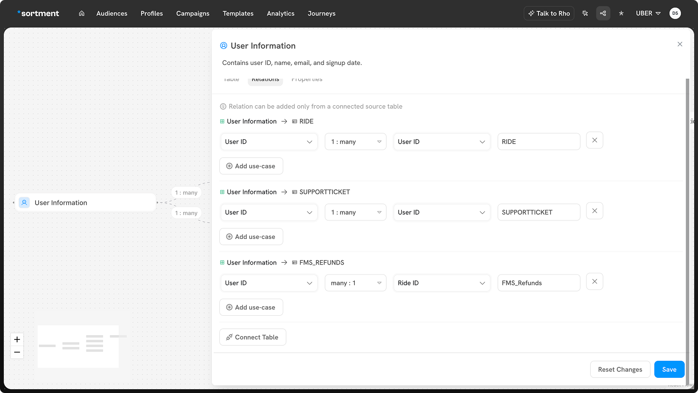

# Setting Up Related Table

Related tables help you add more context on the users data in Sortment. Here's how you can add a related table, either from a connected warehouse or a CSV upload:

1. In the **Schema** view, click the **“Add table”** button (top right of the canvas).
2. Select **“Add related table”** from the dropdown.
3. In the **Setup** step, choose your source:
   * **Warehouse** – Select this if you're linking to a table already synced with data warehouse.
   * **CSV** – Use this if you're uploading data from a CSV file.


For CSV upload make sure your file follows the format:

* **Headers** must contain only **letters, numbers, or underscores,** No spaces or special characters are allowed in header names and each header must be **≤ 255 characters**.
* The CSV file must be less than 50MB in size.


.png>)

2. Once you've chosen the data source, you'll see a list of available tables. Select the relevant table (e.g., `FMS_REFUNDS`) and click **Continue**.

.png>)

3. Sortment may suggest a table name based on the table details. This will be helpful in identifying this table easily.
4. Optionally, enter a description.
5. Choose the Primary key column in your related table. This column should contain unique identifier for records in the table.
6. Click Next.

7. Configure the following table properties for each column:
   1. **Visibility:** Turn a column on or off depending on whether you want to use it in Sortment.
   2. **Labels:** Sortment will autosuggest labels and descriptions for your table. Label the fields in your events table. These can be used to filter on events data in Audiences.
   3. **Descriptions** _(optional):_ Describe what your column contains.
   4. **Masked toggle**: Turn this on for sensitive information (e.g., personal identifiable data). Masked data will be protected and hidden by default in UI previews to comply with regulations and security.
   5. **Cached toggle**: Caching a column stores unique values from the column to make them accessible in the filter dropdowns.

8. Once you've configured all the necessary properties, click **“Save”** to finish adding your related table. The new table will now appear in your schema. Now let's define this table's relation to other tables already existing in your schema.

### Joining Tables

1. **Select the table** you want to work with (e.g. `User Information`).
2. Go to the relations tab to join the  `FMS_REFUNDS`  with  `User Information` .

<figure><figcaption></figcaption></figure>

3. Click **connect table** at the bottom.
4. In the join setup:

* Choose the **column from the current table** you want to join on (e.g. `Id` from `User Information`).
* Select the **join type** (`1:1`, `many:1`, etc.).
* Pick the **column from the target table** you want to join to (e.g. `FMS ORDER ID` from `FMS_REFUNDS`).

<figure><figcaption></figcaption></figure>

5. Once your configuration is complete, click **Save**.

This will link the data across tables based on the selected keys, enabling richer queries and insights.
