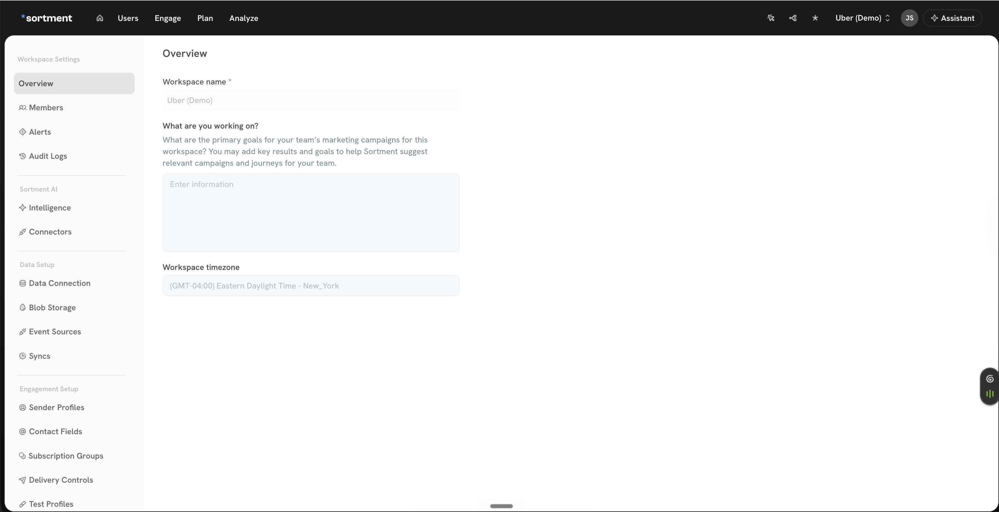
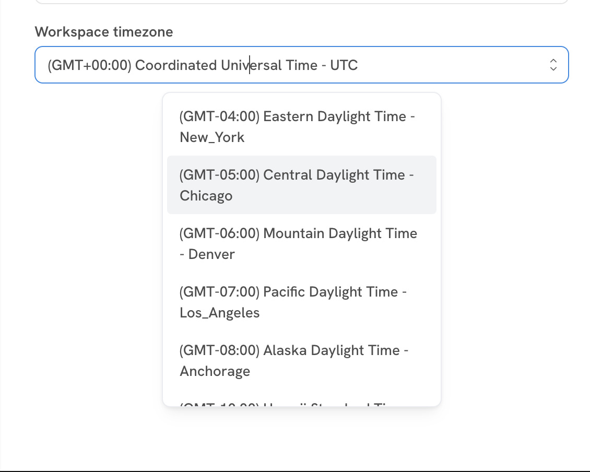

# Workspace Timezone

The **workspace timezone** is a single setting that controls how every time-based feature in Sortment interprets and displays time. Aligning on this early during onboarding is important — once the workspace is in active use, changing it will shift the reference point for ongoing schedules, quiet hours, and historical timestamps.

## What it is

The workspace timezone sets the canonical time reference for your Sortment workspace. Every scheduled action, time-bound rule, and displayed timestamp uses this as the source of truth. It is set per workspace, so different workspaces (for example, separate regions or business units) can each have their own timezone.

## Where it shows up

Any time-based setting or display in the workspace reads from this single value. The most important places it affects:

* **Quiet Hours** in [Delivery Controls](delivery-controls.md) — the windows you set for "do not send during these hours" are interpreted in the workspace timezone.
* **Sync Schedules** in [Sync Schedules](sync-schedules.md) — the system timezone label shown next to schedules (for example, `IST UTC+05:30`) is the workspace timezone.
* **Journey scheduling** in Journey Settings — the schedule UI labels times with the workspace timezone offset (for example, `GMT+05:30`).
* **Activity timestamps** across the product — for example, when an audience was created, when a campaign was last run, when an event was received. All of these are rendered in the workspace timezone.


If a teammate in a different geography sees a different time than you expect on a campaign run or audience creation timestamp, it is usually because they are mentally converting from their local time — the value itself is always the workspace timezone.


## How to change it

1. Open **Workspace Settings → Overview**.
2. Locate the **Workspace timezone** field (below "What are you working on?").

<figure><figcaption>
Workspace Settings → Overview — the workspace timezone field
</figcaption></figure>

3. Click the field to open the timezone dropdown and select the timezone you want. Each option is labelled with the GMT offset and a representative location (for example, `(GMT-05:00) Central Daylight Time - Chicago`).

<figure><figcaption>
Workspace timezone dropdown
</figcaption></figure>

4. Save the change. The new timezone immediately becomes the reference for all time-based features and displays in this workspace.


**Changing the timezone affects active schedules.** Quiet hours, sync schedules, and journey schedules will continue to fire at the same *wall-clock* time in the new timezone — not the same instant in time. Review active campaigns, journeys, and syncs after a change to confirm they still run when you expect.


## Picking the right timezone during onboarding

A few guidelines we apply during onboarding:

* **Match the merchant's business operations timezone**, not the data team's location. Quiet hours and journey schedules are about reaching the end customer at the right local time.
* **Multi-region merchants** should pick the timezone where the majority of recipients are. If recipients are spread across regions, consider using journey-level timezone controls (where supported) rather than the workspace setting alone.
* **Daylight Saving Time** is handled automatically — choosing `Central Daylight Time - Chicago` means the workspace will track CST/CDT transitions for you.
