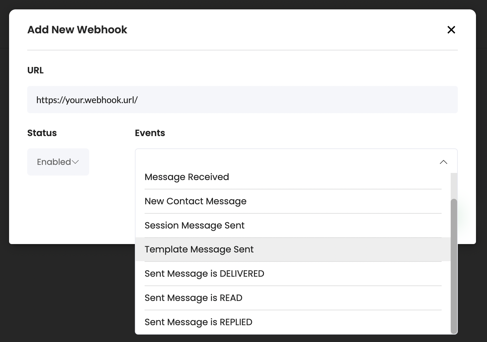

# WATI

## Overview

Sortment lets you send broadcast messages via your existing WATI account. It is required to set up / have a WATI account before configuring the same on Sortment.&#x20;

### Set up your WATI account on Sortment

1. Navigate to channels&#x20;
2. Under WhatsApp channel, select WATI as the provider / integration&#x20;
3. Add the following details&#x20;
   1. Access token
   2. API endpoint&#x20;


You can find both of these in your WATI dashboard under API docs&#x20;


4. Fetch your Admin access token of the Meta account linked with the phone number being used on WATI&#x20;


_**Why is this needed ?**_\
This allows Sortment to fetch the templates created against your WATI account from Meta directly. Sortment will use these imported templates to send messages in journeys / campaigns as per requirements.&#x20;


1. Log in to business.facebook.com&#x20;
2. Navigate to Settings -> Users -> System Users
3. Create an admin system user by clicking on the "Add icon" in the sub-nav bar&#x20;
   1. Give a user name and assign System user role as admin&#x20;

<figure><figcaption>
Screenshot of Meta process to create system user 
</figcaption></figure>


If you already have created an admin system user, Meta will not allow you to create another. \
\
In this case, you will have to share the created admin system user token with Sortment


## Set up Callback for events

This will allow Sortment to listen to necessary events to augment analytics and further audience creation.&#x20;

To set up the same,&#x20;

1. Click on '**Webhooks**' on the top navigation on WATI Dashboard
2. Click on '**Add Webhook**'
3. Enter the full webhook URL, set the status as '**Enabled**', and choose the events you would like to capture with this webhook
   1. The URL to be used here is: [https://callback.fyno.io/?fyno-provider=wati](https://callback.fyno.io/?fyno-provider=wati)

<figure><figcaption>
WATI screens for adding a webhook and selecting required events 
</figcaption></figure>


The following events should be chosen while setting up the webhook:&#x20;

1. Template Message Sent
2. Sent Message is DELIVERED
3. Sent Message is READ
4. Sent Message is REPLIED &#x20;

 


 
