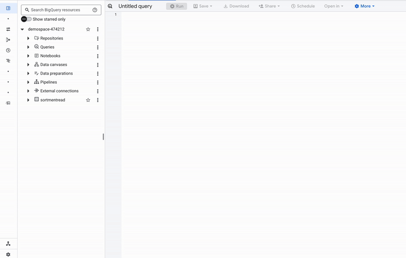
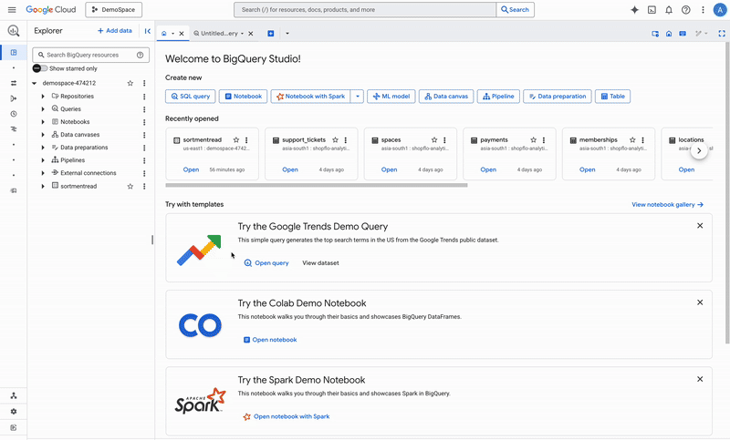

# BigQuery

## Overview

Sortment lets you access data stored in your BigQuery warehouse and use it to create user schema and audiences.

> 📘 Connecting Sortment to BigQuery requires some setup in both platforms. It's recommended to set up a service account with the correct permissions in BigQuery before configuring the connection in Sortment.

## Connection configuration

To get started, there are 4 main steps to setup the connection:

1. Create a GCP Service Account and configure project permissions
2. Configure dataset permissions
3. Create a BQ dataset to store snapshots
4. Connect your BigQuery to the Sortment

### Create a GCP Service Account and configure project permissions

* Navigate to the project where your data is stored, and click on **IAM & Admin** in the left panel
* Click Service Accounts in the side panel on this page.
* Create the service account by setting up a name and description

<figure><figcaption>
Service account setup
</figcaption></figure>

Next, setup following permissions for this account at project level:

* BigQuery Job User
* BigQuery Read Session User
* BigQuery Metadata Viewer

Step 3 on GCP to add users to this service account is not required for Sortment and can be skipped. Click **Done**.

For the created role, navigate to the **Keys** tab and click **Add Key**. Choose **JSON** as the key type. On **Create**, a JSON file will download to your computer. This will be uploaded to Sortment on the Bigquery page.

<figure><figcaption></figcaption></figure>

### Configure dataset permissions

Within your GCP project, navigate to the datasets that you want to connect to Sortment. You can connect tables from different datasets, as long as the joins exist within the same dataset, and the service account has permissions for each dataset the tables are a part of.

To give the required access:

#### **Step 1: Assign dataset role**

1. In your project, click on **BigQuery** in the left panel, then click **BigQuery Studio** in the dropdown.
2. Click on the **three vertical dots** next to the dataset you want to connect.
3.  Click **Share → Manage permissions**. On the side panel, click **Add Principal**. 

    <figure><figcaption></figcaption></figure>
4.  Add the service account created earlier and assign the **BigQuery Data Viewer** role. 

    <figure><figcaption></figcaption></figure>
5. Save the changes.

#### **Step 2: Add extra permissions**&#x20;

The service account also needs two additional permissions that are not part of the Data Viewer role:

* `bigquery.tables.list`
* `bigquery.datasets.get`

To add these:

1. Go to **IAM & Admin → Roles** in the GCP Console.
2. Click **Create Role** (or edit an existing custom role if you already use one for Sortment).
3. Under **Permissions**, add the following:
   * `bigquery.tables.list`
   * `bigquery.datasets.get`&#x20;
4. Save the role
5.  Return to your dataset, click **Share → Manage permissions**, and assign this custom role to the same service account. 

    <figure><figcaption></figcaption></figure>
6. Save the setup when complete.
7. Save the setup

### Create a BQ dataset to store snapshots


Ensure all datasets are available in the same region (read datasets and write dataset)


Sortment manages the audience and campaigns data in your warehouse by creating respective tables.   These tables will be stored in the dataset where Sortment has write access. It is recommended to create a new dataset for Sortment. Follow these steps to create a new dataset with respective permissions:

* In the respective project, click on three vertical bubbles and click **Create new dataset**.&#x20;
* Set **Dataset ID** and set respective region. Copy this name to add to Sortment Bigquery form later.
* Once the dataset is created, click **Share,** then manage permissions. On the side panel, click on **Add Principal** button.
* Add the service account created earlier and add **Data Owner** permission and save.

<figure><figcaption>
Create dataset for sortment to write into
</figcaption></figure>

Now, enter the following required fields into Sortment:

* **Project ID**: This is the unique identifier for your GCP project on Google Cloud. You can find this in GCP console.
* **Location**: This is the region of your BigQuery datasets.
* **Dataset**: The is the dataset that Sortment will use to write data back in BigQuery.
* **Key File:** This is the service account JSON file that gives Sortment access to certain tables and schemas in BigQuery.

### Test connection

When setting up a source for the first time, Sortment validates the following:

* Network connectivity
* BigQuery credentials
* Permission to list schemas and tables
* Permission to write to the schema

All configurations must pass them for uninterrupted access to Sortment. Some sources may initially fail connection tests due to timeouts. Once a connection is established, subsequent API requests should happen more quickly, so it's best to retry tests if they first fail. You can do this by clicking Continue again.

If you've retried the tests and verified your credentials are correct but it is still failing, reach out to [support@sortment.com](mailto:support@sortment.com)

## Tips and troubleshooting

**Request Prohibited: VPC Service Controls Error:** May occur if VPC Service Controls are enabled for the project. The serivce account needs to be whitelisted to resolve this error.

If you encounter an error or question not listed here and need assistance, don't hesitate to [reach out](mailto:support@sortment.com). We're here to help.

### Connection timeout

When initially testing your connection, you may receive a connection timeout error. Once a connection is established, subsequent API requests should happen more quickly, so it's best to retry the tests if they first fail. You can do this by clicking Continue again.
