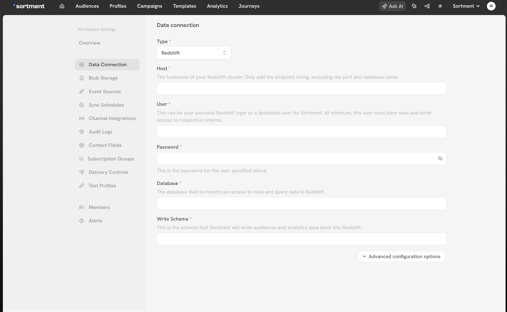

# Redshift

## Overview

Sortment lets you access data stored in your Redshift warehouse and use it to create audiences.

> 📘 Connecting Sortment to Redshift requires some setup in both platforms. It's recommended to set up a service account with the correct permissions in Redshift before configuring the connection in Sortment.

## Connection configuration


### Connection type

Right now, **Sortment supports only direct connection over public internet**. Since data is encrypted in transit via TLS, a direct connection is suitable for most use cases.


### Redshift credential setup

<figure><figcaption><p>Redshift setup form</p></figcaption></figure>

Following details are required by Sortment:

*   **Host**: The hostname of your Redshift cluster. The hostname can be found by visiting the [Redshift web console](https://console.aws.amazon.com/redshiftv2/home),  navigating to the Clusters panel, and clicking your cluster. Copy the Endpoint string, excluding the port and database name.<br>

    > _Note: This is the network endpoint for the Redshift cluster, not related to an AWS access key or secret._
* **Username**:&#x20;
  * This must be a Redshift database user (not an AWS IAM user) that can log into the database. This can be your personal Redshift login or a dedicated user for Sortment. At minimum, this user must have:
    * Read access to your business data relevant for Sortment.
    * Read/write access to the dedicated schema specified below, where Sortment can write campaign and analytics data.
    * Action: Follow the [Redshift query reference](redshift.md#redshift-query-reference-to-create-user-with-required-access) to create a database user and grant the relevant access.
* **Password:**  This is the database password for the Redshift database user specified above.
* **Database**: The name of the database in your Redshift cluster. This is where schemas with your business data  are created. Most clusters have only one database. Visit the [Redshift web console](https://console.aws.amazon.com/), navigate to the **Clusters** panel, and click your cluster. The database name is shown in the **Properties** tab.
* **Write Schema**: The name of the schema in your Redshift cluster where Sortment will get write access for saving campaigns and analytics data. This schema is used to compile and run any queries. Follow the [Redshift query reference](redshift.md#redshift-query-reference-to-create-user-with-required-access) to create a user with relevant access.

**Advanced configuration options**

* **Port:** The port number of your Redshift cluster. The default is 5439, and seldom it is different. To confirm, visit the [Redshift web console](https://console.aws.amazon.com/), navigate to the Clusters panel, and click your cluster. The port number is shown in the Properties tab.


### Redshift query reference to create user with required access

For the setup, you need to create a user (or share an existing user) with certain permissions on your data in Redshift.&#x20;


You need **sysadmin** privileges to create a new user on Redshift.


To access query editor, visit the [Redshift web console](https://console.aws.amazon.com/), navigate to the **Clusters** panel, and click your cluster. In the query data dropdown, pick **Query Editor V2**.

**Step 1: Create a new Redshift User.**

The `user_password` needs to be in single quotes to execute the  query correctly.

```sql
CREATE USER {$user_name} PASSWORD {$user_password};
```

**Step 2: Give read access to the schema(s)  which have data you want to access on Sortment.**

You will need to run these commands for each schema. Replace `{$schema_name}` with your actual schema name in each case.

```sql
GRANT USAGE ON SCHEMA {$schema_name} TO {$user_name};
GRANT SELECT ON ALL TABLES IN SCHEMA {$schema_name} TO {$user_name};
ALTER DEFAULT PRIVILEGES IN SCHEMA {$schema_name} GRANT SELECT ON TABLES TO {$user_name};
```

**Step 3: Create write schema for Sortment.**

This will be used to save campaigns and analytics data. Once created, give read and write access to this schema.

```sql
CREATE SCHEMA {$new_schema_name} AUTHORIZATION {$user_name};

GRANT INSERT, UPDATE, DELETE, SELECT ON ALL TABLES IN SCHEMA {$new_schema_name} TO {$user_name};
ALTER DEFAULT PRIVILEGES IN SCHEMA {$new_schema_name} GRANT INSERT, UPDATE, DELETE, SELECT ON TABLES TO {$user_name};
```

### Test connection

When setting up a source for the first time, Sortment validates the following:

* Network connectivity
* Redshift credentials
* Permission to list schemas and tables
* Permission to write to the schema

All configurations must pass them for uninterrupted access to Sortment. Some sources may initially fail connection tests due to timeouts. Once a connection is established, subsequent API requests should happen more quickly, so it's best to retry tests if they first fail. You can do this by clicking Continue again.

If you've retried the tests and verified your credentials are correct but it is still failing, reach out to [support@sortment.com](mailto:support@sortment.com)

