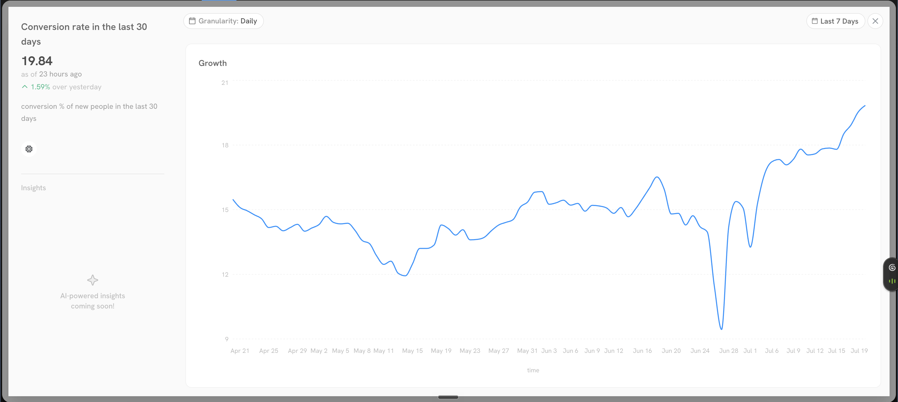
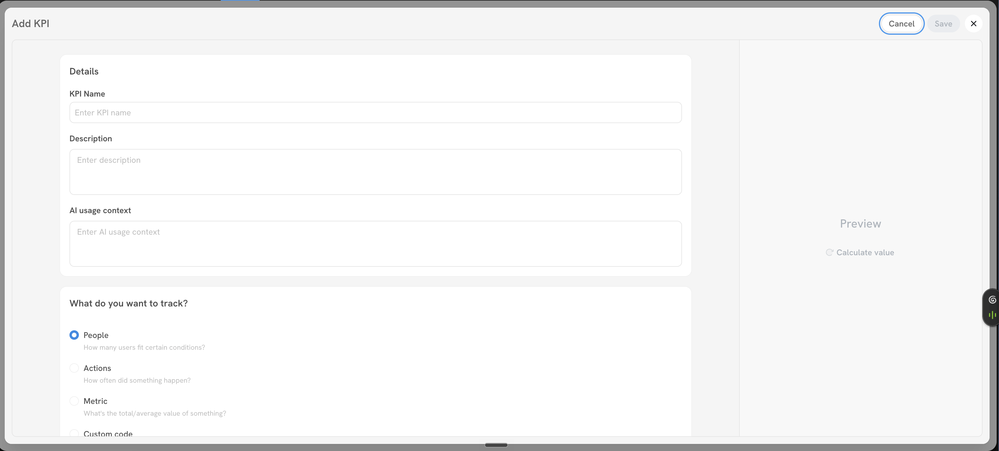
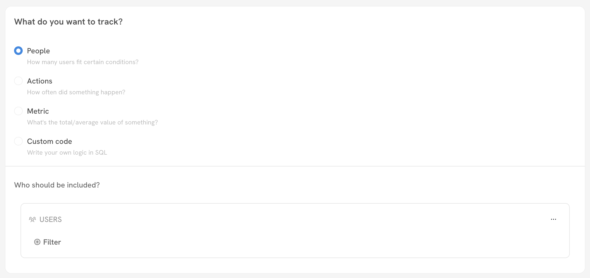
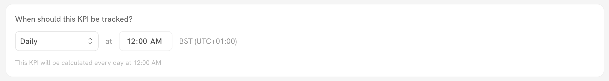

# KPIs

## What is a KPI?

A **KPI (Key Performance Indicator)** is any measurable value that tells you how your business is doing against a goal. In Sortment, a KPI is a metric you define once and then track over time on your dashboard, so you always have a live read on the numbers that matter most.

A KPI can be almost anything you care about. Common examples:

* **Number of paid users** — how many users currently hold a paid plan.
* **Conversion rate in an onboarding funnel** — the percentage of new users who complete onboarding.
* **Day 30 churn rate** — the share of users who stop being active within 30 days of signing up.

KPIs are flexible by design. You can define them with **no-code logic** on the Sortment dashboard, using the same filters you already use to build audiences, or you can write the exact logic yourself in **SQL**. Once created, a KPI is calculated on a schedule you choose and charted over time so you can spot trends, spikes, and drops at a glance.

<figure><figcaption>
A tracked KPI showing its current value, the change over the previous period, and a growth chart over time
</figcaption></figure>


KPIs share the same filtering engine as audiences. If you know how to build an audience, you already know how to define most KPIs. See [Audience Filters](../engage/audiences/audience-filters.md) for a full reference on filter conditions and operators.


***

## Creating a KPI

### Step 1: Open the KPI creator

From the KPIs dashboard, click **Create KPI** in the top-right corner. You can switch between grid and list views of your existing KPIs using the toggle next to the button.

<figure><figcaption>
The Create KPI button and the grid/list view toggle on the KPIs dashboard
</figcaption></figure>

### Step 2: Add the details

In the **Add KPI** panel, fill in the basic details:

* **KPI Name** — a short, recognisable name (e.g. `Day 30 churn rate`).
* **Description** — what this KPI measures and why it matters, so teammates understand it at a glance.
* **AI usage context** — optional guidance for Sortment AI on how this KPI should be interpreted. Use it to encode expectations or thresholds the AI should be aware of, for example: _"We want this KPI to never fall below 20%."_

<figure><figcaption>
The Add KPI panel with Details fields, the tracking-type selector, and the live Preview panel on the right
</figcaption></figure>


AI usage context is workspace memory scoped to this KPI. For business definitions and context that apply everywhere, use [Intelligence blocks](intelligence-blocks.md) instead.


### Step 3: Choose what to track

Under **What do you want to track?**, pick one of four modes depending on the kind of value you want to measure.

<figure><figcaption>
The four tracking modes and the filter builder used to define who or what is included
</figcaption></figure>

#### People

Counts **how many users fit certain conditions** — typically the number of people in an audience. Under **Who should be included?**, add conditions using the same filter builder as the audience builder. For example, filter to users on a paid plan to track your number of paid users.

#### Actions

Counts **how often something happened**, based on an event you track. For example, count the number of purchases in a period. You can narrow the count with filters within the Actions block — for instance, count only purchases made by new users.

#### Metric

Computes **the total or average value of something**. For example, take the highest purchase value per user in the last 30 days and track that value across all users. Use this mode when the KPI is a numeric aggregate rather than a count.

#### Custom code

Lets you **write your own logic in SQL** for full flexibility. Paste a query that returns your KPI value. You can use Sortment AI to draft the SQL for you and copy-paste it here.


Not sure how to express a metric in SQL? Ask Sortment AI to write the query for you, then paste it into Custom code and preview the result before saving.


### Step 4: Preview and format the value

The **Preview** panel on the right shows what the KPI value will look like before you publish. Click **Calculate value** to run the logic and confirm you get the number you expect.

To keep your dashboard clean and readable, apply **custom formatting** to the value. You can format the output as:

* **Currency** — for monetary values (e.g. revenue, average order value).
* **Number** — for counts (e.g. number of paid users).
* **Percentage** — for rates (e.g. conversion rate, churn rate).


Always preview the value before saving. A quick check here catches filter or SQL mistakes before the KPI starts charting on your dashboard.


### Step 5: Set the tracking frequency

Under **When should this KPI be tracked?**, choose how often Sortment recalculates the KPI. Set it to run as frequently as **Daily** at a specific time, or **Weekly** or **Monthly**. The times use your workspace timezone.

<figure><figcaption>
Setting a KPI to recalculate daily at a fixed time in the workspace timezone
</figcaption></figure>


The timezone shown here is your workspace timezone. To change it, see [Workspace Timezone](../settings/workspace-timezone.md).


### Step 6: Save

Click **Save** to publish the KPI. It now appears on your KPIs dashboard, where it displays the latest value, the change over the previous period, and a growth chart that updates on your chosen schedule.
